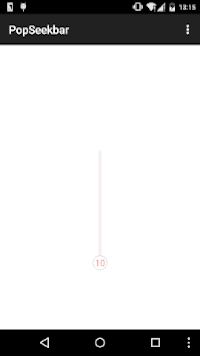

# PopSeekbar
Nice and pop seek bar on Android platform <br/>
 

## System Requirement
Android v2.2+

## TODO
Developed by AndroidStudio

## Usage
```xml
<com.jiahuan.popseekbar.PopSeekBarView
        android:id="@+id/psk"
        android:layout_width="wrap_content"
        android:layout_height="300dp"
        android:layout_centerInParent="true"
        app:pop_button_drawable="@mipmap/seekbar_circle"
        app:pop_push_drawable="@mipmap/seekbar_push">
</com.jiahuan.popseekbar.PopSeekBarView>
```
Whatever the width is set, the width only related to the size of the big circle radius, is equal to the double size of big circle radius.

## License
Copyright 2015 JiaHuan

Licensed under the Apache License, Version 2.0 (the "License"); you may not use this file except in compliance with the License. You may obtain a copy of the License at

http://www.apache.org/licenses/LICENSE-2.0

Unless required by applicable law or agreed to in writing, software distributed under the License is distributed on an "AS IS" BASIS, WITHOUT WARRANTIES OR CONDITIONS OF ANY KIND, either express or implied. See the License for the specific language governing permissions and limitations under the License.
